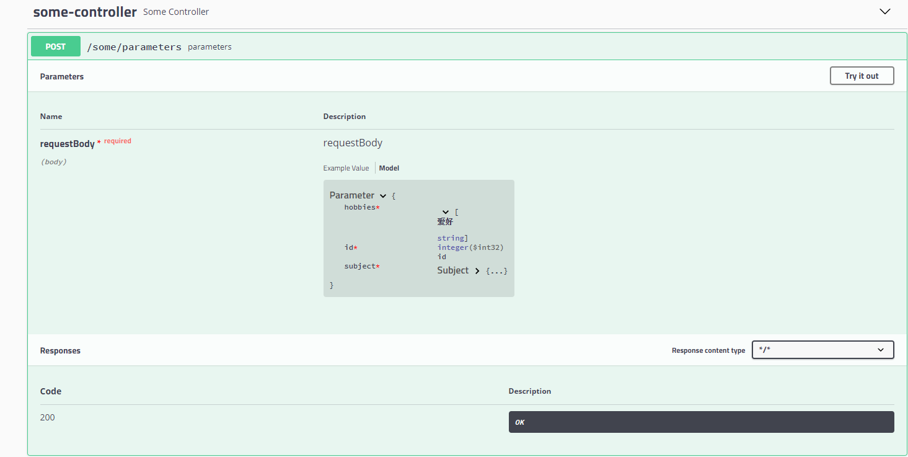
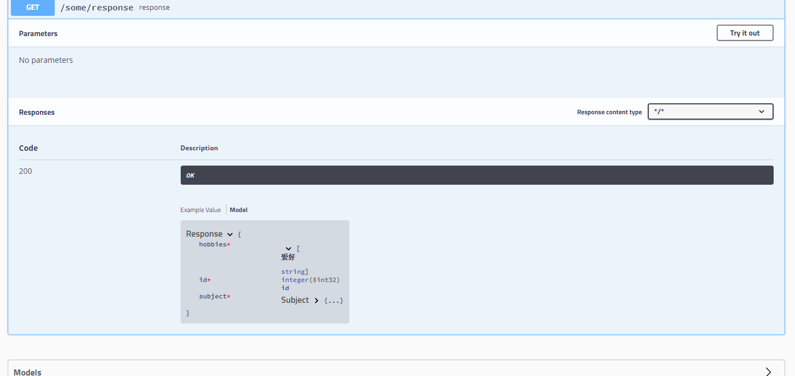

[[swagger-extension]]
= swagger注解的扩展
:source-highlighter: highlightjs
:sectnums:

接口的响应并不总是复杂的，可能仅需要返回一个资源id，如果新建一个类，这个类只有一个属性有点没必要，如果返回map，swagger不能内省响应信息。本项目采用ByteBuddy库运行时动态生成JavaBean类，帮助swagger完成内省
[[maven-localtion]]
== maven坐标

[source,xml]
----
<dependency>
    <groupId>io.github.gh6497</groupId>
    <artifactId>swagger-extension</artifactId>
    <version>0.0.2</version>
</dependency>

----

[[usage]]
== 用法

.SwaggerConfig.java
[source,java]
----

@Configuration(proxyBeanMethods = false)
@EnableSwagger2
public class SwaggerConfig {
    @Order(SwaggerPluginSupport.SWAGGER_PLUGIN_ORDER + 1000)
    @Bean
    public ResponsePlugin responsePlugin(TypeNameExtractor typeNameExtractor) {
        return new ResponsePlugin(typeNameExtractor);
    }

    @Bean
    public ApiJsonOperationModelsProviderPlugin apiJsonOperationModelsProviderPlugin(TypeResolver typeResolver) {
        return new ApiJsonOperationModelsProviderPlugin(typeResolver, new ByteBuddyClassCreator());
    }

    @Order(SwaggerPluginSupport.SWAGGER_PLUGIN_ORDER + 1000)
    @Bean
    public ParameterPlugin parameterPlugin(TypeNameExtractor typeNameExtractor,TypeResolver typeResolver) {
        return new ParameterPlugin(typeNameExtractor,typeResolver);
    }

    private ApiInfo apiInfo() {
        return new ApiInfoBuilder()
          .title("swagger-extension")
          .contact(new Contact("len", "https://blog.csdn.net/csdn6497", "lencai@live.cn"))
          .version("1.0")
          .description("swagger-extension-usage")
          .build();
    }

    @Bean
    public Docket docket(TypeResolver typeResolver) {

        return new Docket(DocumentationType.SWAGGER_2)
          .select()
          .apis(RequestHandlerSelectors.basePackage("me.len.swagger.extension"))
          .paths(PathSelectors.any())
          .build()
          .useDefaultResponseMessages(false)
          .apiInfo(apiInfo());
    }
}

----

.Application.java
[source,java]
----

@SpringBootApplication
public class ExtensionApplication {

    public static void main(String[] args) {
        SpringApplication.run(ExtensionApplication.class, args);
    }

}

----

.SomeController.java
[source,java]
----
@RestController
@RequestMapping("/some")
public class SomeController {
    @GetMapping("response")
    @ApiJsonObject(
      name = "Response",
      properties = {
        @ApiJsonProperty(name = "id", value = "id", clazz = Integer.class),
        @ApiJsonProperty(name = "hobbies", value = "爱好", container = "List"),
        @ApiJsonProperty(name = "subject", value = "科目", clazz = Subject.class)
      }
    )
    public Map<String, Object> response() {
        return Collections.emptyMap();
    }

    @PostMapping("parameters")
    public void parameters(@RequestBody
                           @ApiJsonObject(
                             name = "Parameter",
                             properties = {
                               @ApiJsonProperty(name = "id", value = "id", clazz = Integer.class),
                               @ApiJsonProperty(name = "hobbies", value = "爱好", container = "List"),
                               @ApiJsonProperty(name = "subject", value = "科目", clazz = Subject.class)})

                             Map<String, Object> requestBody) {

    }

    @Getter
    @Setter
    @ToString
    @FieldDefaults(level = AccessLevel.PRIVATE)
    public static class Subject {
        @ApiModelProperty(value = "名称")
        String name;
    }

}

----

=== 效果

